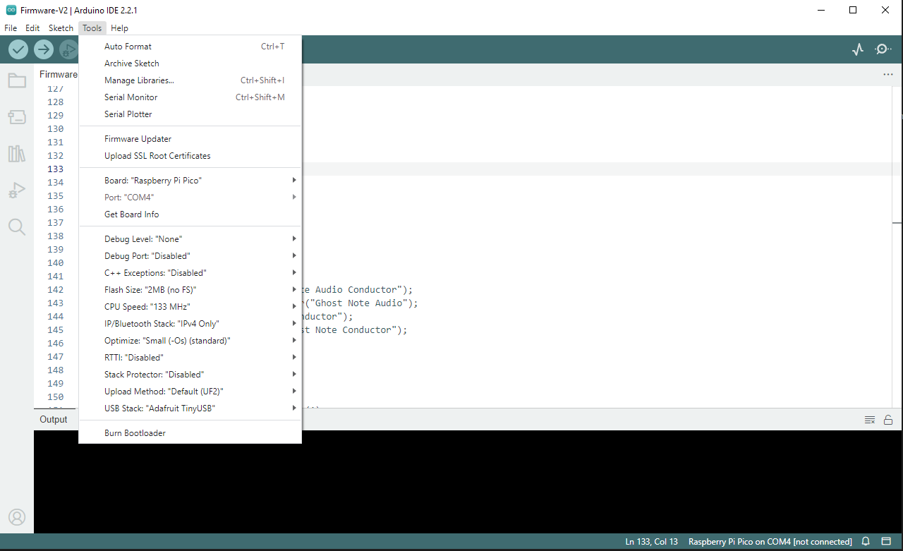
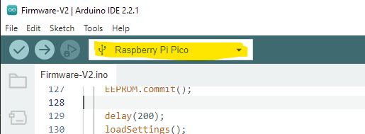

# Ghost Note Audio Conductor

This repository contains the firmware for the Conductor MIDI controller, as well as the online programmer.

[**Open Editor**](https://ghostnoteaudio.github.io/Conductor/Editor.html)

## Instructions for developers

### Setup

You will need to install the following items:

* Arduino IDE (version 2.2 or later)
* Arduino Pico board support
  * https://arduino-pico.readthedocs.io/en/latest/install.html
* MIDI Library by Francois Best and lathoub
  * https://www.arduino.cc/reference/en/libraries/midi-library/
  * Use the library manager in the IDE to install it.

Note: The project uses the Adafruit TinyUSB Library. This is included in the Pi Pico Arduino IDE board setup, select this from Tools->USB Stack. *DO NOT* install this library separately. If you already have it installed in your IDE you may need to remove it, otherwise you get errors complaining about duplicated code.

### Build and upload the firmware

0. Open the Firmware-V2.ino file in Arduino IDE
1. Connect the Conductor unit to your computer via USB
2. Choose the Pi Pico as the target board
    * Tools -> Board -> Raspberry Pi Pico/RP2040 -> Raspberry Pi Pico
3. Configure your settings to match the following screenshot (most likely they are all identical by default, except the USB Stack)

4. Choose the connected board in the dropdown menu

Note that if you have multiple serial port devices or Pi Pico controllers connected, it may not be obvious which is which. You may just have to try until you find the right one :)
5. Hit Upload
6. (sometimes necessary) Disconnect and reconnect the controller from the computer - this allows the USB stack to reset and present itself as a MIDI class compliant device

### FAQ

**Q:** My controller is unresponsive following a failed upload. What do I do?

**A:** You need to reset the Pi Pico using the on-board reset button. Disconnect the USB cable, press and hold the button, then re-apply power / connect the cable. This should let the Pico boot into its bootloader mode.

**Q:** How do I access the reset button?

**A:** You need to open the unit up. Remove the four silver socket screws on the front panel using a hex/allen key. You can then remove the top panel and circuit board from the enclosure. There are small tabs in each corner which prevent the circuit board from lifting out directly. You must lift the lower side out first. It's easiest to lift one corner, and once the circuit board is free, the whole thing will come out. Be patient and careful :)